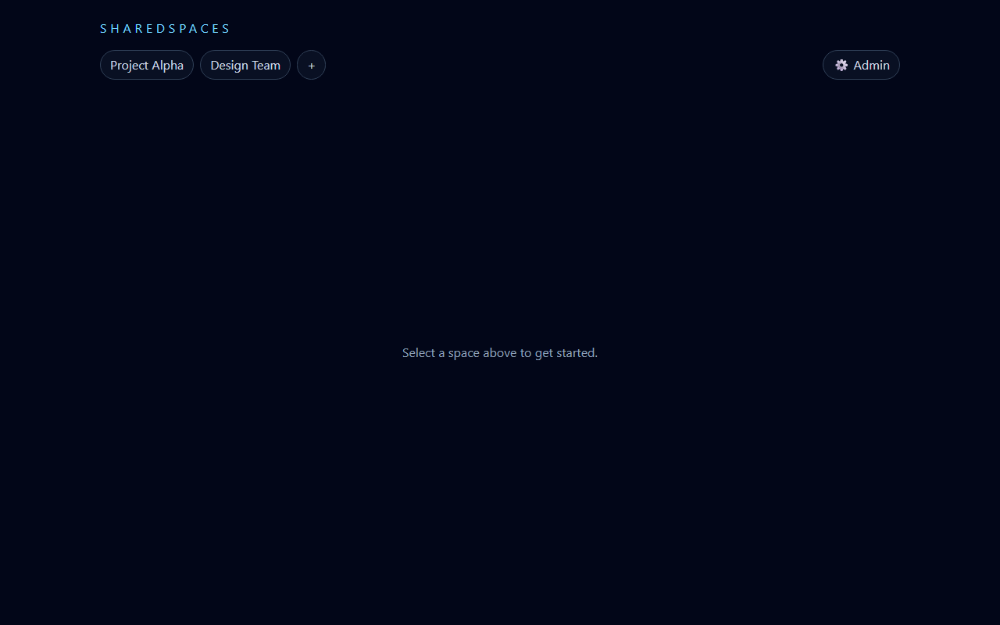
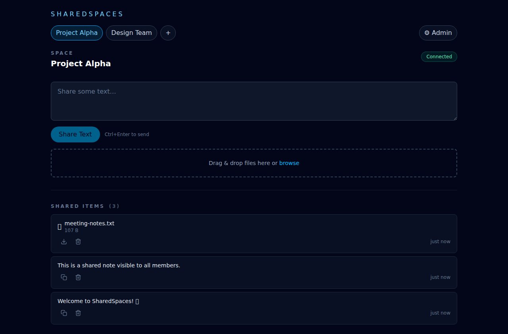

# SharedSpaces

> A self-hostable web platform for real-time file and text sharing via QR code and PIN.

## About

**SharedSpaces** is a lightweight, anonymous collaboration tool that lets users join shared spaces with a simple QR code or PIN — no accounts, no tracking, no friction. Share files, text, and links in real-time with anyone in the space, all under a display name you choose.

The platform is built for **self-hosting** with minimal dependencies (SQLite, local filesystem) and clean architecture. The server is a pure API with no rendered UI. The client is a standalone web app that can connect to any server — including multiple servers simultaneously. Perfect for quick file drops, event collaboration, classroom sharing, or temporary project spaces.

Anonymous by design: users pick a display name when joining a space. No email, no registration, no persistent identity across spaces. When you're done, leave. When the space is deleted, everything is gone.

## Key Features

- **QR/PIN join** — Scan a code or enter a short PIN to join a space instantly
- **Real-time sync** — See files and messages appear live via WebSocket (SignalR)
- **Anonymous identity** — Display name only, no accounts or persistent profiles
- **Multi-server support** — Connect to multiple servers simultaneously from one client
- **Self-hostable** — SQLite database, local file storage, zero cloud dependencies
- **JWT-based access** — Secure, token-based authentication with no expiration
- **File + text sharing** — Upload files or post text snippets; quota enforced per space
- **Admin controls** — Create spaces, generate invitations, manage content
- **CLI tool** — Join spaces, upload files, and sync folders from the terminal

## Screenshots

**Home view** — Your spaces across multiple servers:



**Inside a space** — Real-time shared content:



## Tech Stack

- **Server:** .NET 10 (ASP.NET Core Web API)
- **Client:** Lit HTML + Web Components, TypeScript, Vite, Tailwind CSS v4
- **CLI:** .NET global tool (`System.CommandLine`) with SignalR real-time sync
- **Real-time:** SignalR (WebSocket)
- **Database:** SQLite with EF Core (swappable to PostgreSQL)
- **Auth:** JWT (no expiration; validity = member existence)
- **Storage:** Local filesystem (abstracted for future cloud providers)

## Getting Started

### Prerequisites

- [.NET 10 SDK](https://dotnet.microsoft.com/download/dotnet/10.0)
- [Node.js 20+](https://nodejs.org/) (for client build)

### Development

1. **Clone the repository:**
   ```bash
   git clone https://github.com/maraf/SharedSpaces.git
   cd SharedSpaces
   ```

2. **Run the server:**
   ```bash
   cd src/SharedSpaces.Server
   dotnet restore
   dotnet run
   ```
   The API will be available at `https://localhost:7218` (or `http://localhost:5165`). Check the terminal output for the exact URL.

3. **Run the client (in a separate terminal):**
   ```bash
   cd src/SharedSpaces.Client
   npm install
   npm run dev
   ```
   The client will be available at `http://localhost:5173`.

4. **Connect the client to your server:**
   - Open the client in your browser at `http://localhost:5173`.
   - Use the client UI to add/connect to your server by entering its URL (e.g., `https://localhost:7218`).
   - No environment variables are required for API routing; the server URL is chosen at runtime in the client.

## Command-Line Interface (CLI)

The **SharedSpaces CLI** lets you join spaces, upload files, list spaces, and sync files — all from the terminal, no browser needed.

### Install

```bash
dotnet tool install --global SharedSpaces.Cli
```

### Quick Start

**Join a space** with an invitation link or PIN:
```bash
sharedspaces join "https://server.example.com|550e8400-e29b-41d4-a716-446655440000|123456"
```

**List your spaces:**
```bash
sharedspaces spaces
sharedspaces spaces --json   # machine-readable output
```

**Upload a file:**
```bash
sharedspaces upload myfile.txt --space-id 550e8400-e29b-41d4-a716-446655440000
```

**Sync a folder in real-time** (two-way: downloads from the server and uploads local changes):
```bash
sharedspaces sync --space-id 550e8400-e29b-41d4-a716-446655440000 --folder ~/shared
```

### Commands

| Command | Description |
|---------|-------------|
| `join <url>` | Exchange an invitation PIN for an access token and store it locally |
| `spaces` | List all joined spaces (supports `--json` for machine-readable output) |
| `upload <file>` | Upload a file to a space (`--space-id` required) |
| `sync` | Two-way real-time file sync between a space and a local folder (`--space-id`, `--folder` required) |

### How sync works

The `sync` command keeps a local folder in sync with a space:

- **Initial download** — Fetches all existing files from the space
- **Real-time updates** — Receives new files and deletions via SignalR (WebSocket)
- **Local file watching** — Automatically uploads new files added to the folder
- **Fallback polling** — Falls back to HTTP polling if the WebSocket connection drops
- **Resilience** — Automatic reconnection with exponential backoff, atomic file writes, deduplication to prevent upload loops

Press `Ctrl+C` to stop syncing gracefully.

### Configuration

Tokens are stored in `~/.sharedspaces/config.json`. Each entry contains only the JWT — all metadata (space ID, server URL, display name, space name) is extracted from claims at runtime.

For full CLI documentation, see [`src/SharedSpaces.Cli/README.md`](src/SharedSpaces.Cli/README.md).

### Building for production

**Server:**
```bash
cd src/SharedSpaces.Server
dotnet publish -c Release -o ./publish
```

**Client:**
```bash
cd src/SharedSpaces.Client
npm run build
```

The built client will be in `dist/` and can be served by any static file host.

## Project Structure

```
SharedSpaces/
├── src/
│   ├── SharedSpaces.Server/          # ASP.NET Core Web API + SignalR
│   │   ├── Domain/                   # Entities, value objects
│   │   ├── Features/                 # Vertical slice: Spaces, Invitations, Tokens, Items, Admin
│   │   ├── Infrastructure/           # EF Core, file storage, SignalR hub
│   │   └── Program.cs
│   ├── SharedSpaces.Client/          # Lit HTML + Web Components SPA
│   │   ├── e2e/                      # Playwright tests
│   │   └── src/
│   │       ├── features/             # join, space-view, admin
│   │       ├── components/           # Reusable UI components
│   │       ├── lib/                  # SignalR client, API client, utilities
│   │       └── index.ts
│   ├── SharedSpaces.Cli/             # .NET global tool (CLI entry point)
│   │   └── Commands/                 # join, spaces, upload, sync
│   └── SharedSpaces.Cli.Core/        # Shared CLI library
│       ├── Services/                 # API client, config, sync engine
│       └── Models/                   # Config model, JWT-backed space entry
├── tests/
│   ├── SharedSpaces.Server.Tests/
│   └── SharedSpaces.Cli.Core.Tests/
├── docs/
│   └── screenshots/                  # UI screenshots
└── SharedSpaces.sln
```

## Architecture

The server and client are **fully decoupled**. The server is a pure API with no UI. The client is a standalone SPA that connects to any server via its base URL. A single client instance can connect to multiple servers simultaneously, each with its own JWT token for authentication.

**Key design decisions:**
- **JWT tokens have no expiration** — validity is determined by the existence of a `SpaceMember` record and its `IsRevoked` flag
- **Invitation PINs are one-time use** — deleted immediately after a token is issued
- **Space item IDs are client-generated** — the client creates GUIDs and uses PUT/upsert semantics
- **Multi-server by default** — JWT claims include `server_url` so the client knows where to send requests

For detailed architecture, domain model, and API behavior, explore the codebase — the code is the spec, and inline comments call out key design decisions.

